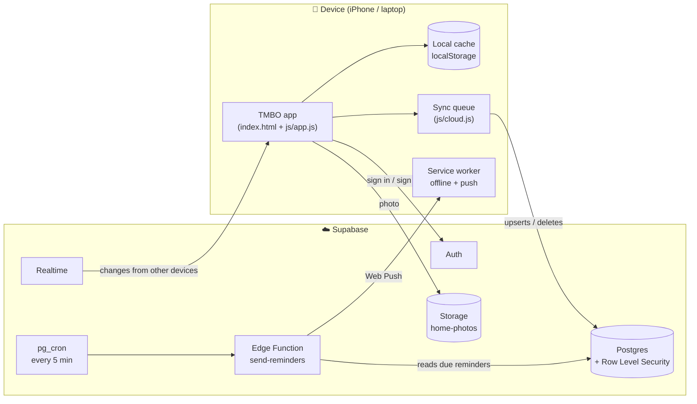

<div align="center">


# TMBO: There Must Be Order

**A to-do list, calendar and study app that ranks your priorities, carries unfinished work forward, and helps you prepare for what's coming up.**

Installable on iPhone · Works offline · Optional accounts with cross-device sync · Push reminders

</div>

<p align="center">
  
  
  
</p>

---

## Why I built this

Most to-do apps treat every task the same. TMBO is built around three ideas:

1. **Rank what matters.** Every task gets a priority tier, and the home screen shows only your **Top 3** for the day.
2. **Nothing falls through the cracks.** Unfinished tasks can **carry over** to the next day automatically, labeled with how long they've been waiting.
3. **Prepare, don't cram.** Add a test, interview or deadline, and TMBO counts down, reminds you in advance, and puts daily prep on your list.

## Features

### ✅ To-do list
- **Four priority tiers** (Must do → Nice to have) that sort your list. You can rename the tiers.
- **One-time or repeating** tasks: every day, weekdays, or custom days. Repeating tasks track **streaks**.
- **Dated lists**: every day has its own list, with a week strip and progress bar.
- **Carry-over**: a per-task switch moves unfinished one-time tasks to the next day ("Carried 2 days · from Sep 24"). Tasks without it are marked *Missed*.
- **Optional reminder time** on any task.

### 🏠 Home screen
- A **motivational graphic** you can customize: 4 illustrated scenes or your own photo, 6 color themes, and 3 quote styles.
- **Quotes**: the default is *"There Must Be Order."*, with 13 more built in. You can write your own or **shuffle** randomly (optionally on every launch).
- **Today's Top 3**: your most important tasks, which you can check off right from Home.
- A **countdown** to your next event, plus stats for the day.

### 📅 Calendar & events
- A month view with task dots and event markers.
- **Events** (tests, interviews, deadlines) with countdown cards.
- **Prep reminders** at 2 weeks, 1 week, 3 days, 1 day before and the day of, with messages tailored to the event type.
- An optional **daily "Prepare: …" task** that appears on your list until the event.

### ⏱️ Study timer
- Focus, short break and long break modes (15/25/45/60-minute focus).
- Logs each session with its subject and totals your focus time for the day.

### 🔔 Notifications
- Opt-in during onboarding or anytime in Settings.
- **Web Push** reminders delivered by a scheduled server function, so they arrive even when the app is closed.
- A **morning Top 3 summary** at a time you choose.

### 👤 Accounts are optional
- **No account:** everything is stored on the device.
- **With an account:** data syncs across phone, laptop and tablet in real time.
- Creating an account later **keeps all your data**.
- **Offline-first:** changes save to the device instantly and sync when you're back online.

### 🔒 App lock
- Lock TMBO with a **PIN, pattern or password**. It locks right away or after 1, 5 or 15 minutes away.
- The lock is saved **only on the device**, as a salted PBKDF2 hash. Five wrong tries trigger a 30-second wait.
- If you forget it: account users unlock with their account password; guests can erase the device and start over.

### 🎨 Personalization
- Light, dark or automatic theme; 8 accent colors plus a custom picker; 4 text sizes.
- Three to-do layouts: **Classic**, **Compact** and **Planner**.

<p align="center">
  
  
  
  
</p>

## Tech stack

| Layer | Technology |
|---|---|
| Front end | Vanilla JavaScript (ES modules), HTML, CSS, inline SVG graphics. No framework and no build step. |
| App shell | Progressive Web App: service worker for offline use and push, web app manifest for installing |
| Back end | [Supabase](https://supabase.com): PostgreSQL, Auth, Storage, Realtime, Edge Functions (Deno) |
| Security | Row Level Security on every table; the publishable key only works together with these rules |
| Scheduling | `pg_cron` + `pg_net` call the reminder function every 5 minutes |
| Hosting | [Netlify](https://netlify.com), deployed automatically from GitHub |

## Architecture



**How sync works:** every change is saved to the device first, so the app feels instant and works offline. If you're signed in, the change also goes into a small **write queue** that combines repeated edits and sends them to Supabase in order, retrying when the connection returns. Other devices hear about the change through **Supabase Realtime** and reload the latest data.

**How reminders work:** every 5 minutes, `pg_cron` calls the `send-reminders` Edge Function. For each user, the function works out the local time in their timezone and builds the due reminders:

- task reminder times
- event prep reminders
- the morning Top 3

It records each one in `sent_reminders` so nothing is sent twice, then delivers them with Web Push to every device the user turned notifications on for.

## Data model

| Table | Purpose |
|---|---|
| `tasks` | Title, tier (1–4), repeat rule, date, carry-over state, reminder time, optional link to an event |
| `task_completions` | One row per day a repeating task was checked off (this powers streaks) |
| `events` | Tests, interviews and deadlines, with reminder days and the prep-task setting |
| `user_settings` | Appearance, home screen (scene, palette, quote), notification preferences, timezone |
| `custom_quotes` | Quotes users write themselves |
| `study_sessions` | Completed focus sessions |
| `push_subscriptions` | One row per device that allowed notifications |
| `sent_reminders` | Keys of reminders already delivered (server-only) |

The full schema, security rules, triggers and storage policies are in [`supabase/schema.sql`](supabase/schema.sql).

## Project structure

```
tmbo/
├── index.html                  App markup
├── css/styles.css              All styles (themes, templates, components)
├── js/
│   ├── app.js                  UI, tasks, events, timer, reminders, app lock
│   ├── cloud.js                Supabase client, row mapping, sync queue, push, photos
│   └── config.js               Your Supabase URL/key and VAPID public key
├── sw.js                       Service worker: offline cache + push notifications
├── manifest.webmanifest        Install settings (name, icons, colors)
├── icons/                      App icons
├── supabase/
│   ├── schema.sql              Tables, Row Level Security, triggers, storage
│   ├── cron.sql                Schedules the reminder function
│   └── functions/send-reminders/index.ts   Edge Function that sends Web Push
├── tools/generate-vapid-keys.html          In-browser generator for push keys
├── netlify.toml                Hosting config (no build step)
├── docs/screenshots/           Images used in this README
└── SETUP.md                    Step-by-step setup guide
```

## Getting started

To run your own copy, follow **[SETUP.md](SETUP.md)**. It walks through creating the Supabase project, deploying to Netlify, installing on iPhone and turning on push notifications.

To try it locally without an account:

```bash
# from the tmbo folder
python3 -m http.server 8080
# then open http://localhost:8080 and choose "Continue without an account"
```

## Privacy & security

- **Accounts are optional.** Without one, no data leaves the device.
- With an account, **Row Level Security** means each user can only read and write their own rows, even though the app talks to the database directly.
- Home-screen photos are stored in a **private** bucket, in a folder only that user can access.
- The app lock secret is never stored or sent. Only a salted PBKDF2-SHA-256 hash is kept on the device.
- No analytics or ads, and no third-party trackers.

## Roadmap

- [ ] Two-way sync with iPhone Calendar / Google Calendar (subscribe feed + Google Calendar API)
- [ ] Apple Shortcuts buttons: start a Clock timer, save to Notes
- [ ] Face ID unlock with passkeys (WebAuthn)
- [ ] Weekly insights: completion rate by tier, focus minutes by subject
- [ ] Import from a backup file; delete an account from inside the app

## Author

**Jayques (Jay) Nelson**, M.S. Data Analytics & Visualization candidate at Morgan State University
[LinkedIn](https://www.linkedin.com/in/jayquesnelson/)

<p align="center"><i>There Must Be Order.</i></p>
